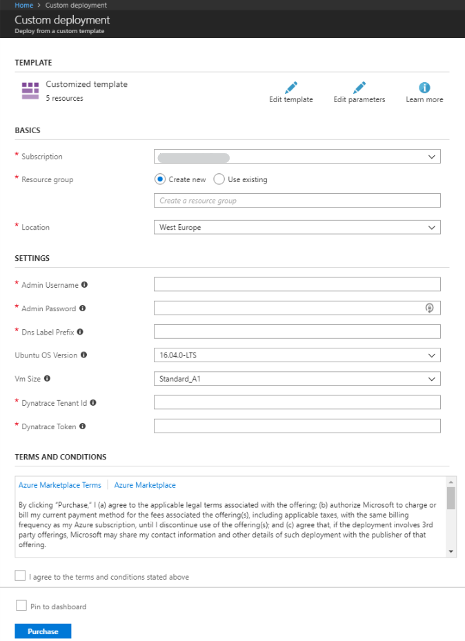

# Deployment of a Ubuntu VM with Dynatrace OneAgent Extension

  

This template allows you to deploy a Ubuntu VM with the Dynatrace OneAgent VM extension installed and fully configured.
The concrete size for the VM can be chosen during the deployment process.

# Bring your own license
During the installation procedure, a Dynatrace tenant ID and a token have to be provided. Get your own free trial here: <a href="https://www.dynatrace.com/trial/">Dynatrace free trial</a>. 

# Installation

Click the "Deploy to Azure" button on top to begin deployment of the VM+OneAgent.
For the installation, a couple of parameters are needed:

- Azure subscription
- Resource group
- Location
- Admin username
- Admin password
- DNS Prefix (has to be unique)
- Ubuntu OS Version
- VM Size
- Dynatrace Tenant ID
- Dynatrace Tenant PaaS Token

# Screenshot

